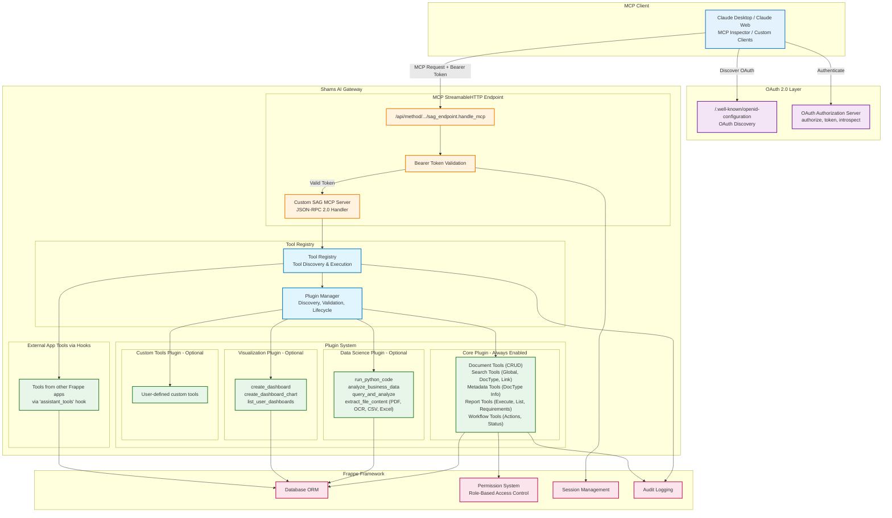
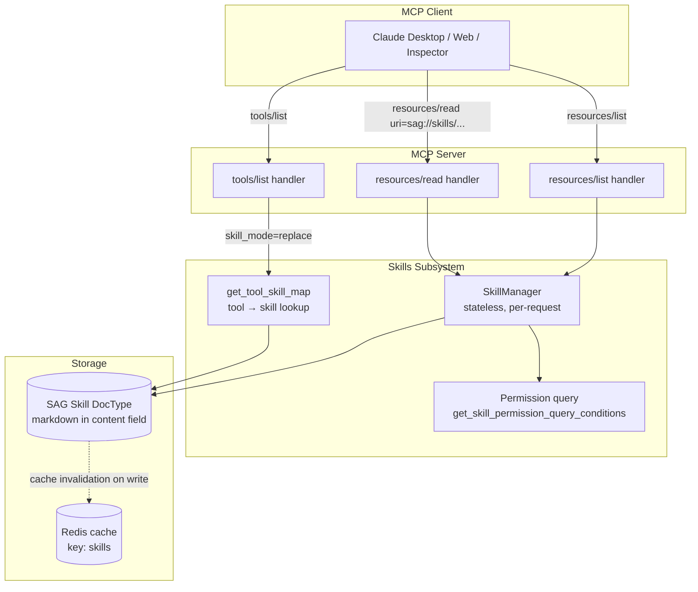

# Shams AI Gateway Architecture

## Overview

Shams AI Gateway is built on a modular plugin architecture that separates core functionality from optional features. This design enables clean separation of concerns, extensibility, and maintainability while following Frappe framework standards.

## System Architecture



## Core Components

### 1. MCP Protocol Layer

The Model Context Protocol (MCP) layer handles communication between AI assistants and the Frappe system using **StreamableHTTP** transport with OAuth 2.0 authentication.

**Key Components:**

- **Custom MCP Server** (`mcp/server.py`): Custom implementation with proper JSON serialization
- **OAuth 2.0 Authentication** (`api/sag_endpoint.py`): Bearer token validation per RFC 9728
- **Protocol Handlers**: Process MCP requests and responses (JSON-RPC 2.0)
- **Request Validation**: Ensure proper protocol compliance
- **Response Formatting**: Convert internal responses to MCP format with `default=str`
- **Error Handling**: Standardized error responses with full tracebacks

**Implementation:**

```
api/
├── sag_endpoint.py              # Main MCP endpoint with OAuth validation
├── oauth_discovery.py           # RFC-compliant OAuth discovery endpoints
├── oauth_wellknown_renderer.py  # Custom page renderer for .well-known
├── oauth_registration.py        # Dynamic client registration (RFC 7591)
└── oauth_cors.py                # CORS handling for public clients

mcp/
├── server.py                    # Custom MCPServer implementation
└── tool_adapter.py              # BaseTool to MCP adapter
```

**Transport:** StreamableHTTP (HTTP POST requests)
**Protocol:** MCP 2025-03-26 with JSON-RPC 2.0
**Endpoint:** `/api/method/shams_ai_gateway.api.sag_endpoint.handle_mcp`
**Authentication:** OAuth 2.0 Bearer tokens

**Why Custom MCP Server?**

We built a custom MCP server implementation instead of using generic libraries because:

1. **JSON Serialization**: Handles Frappe's datetime, Decimal, and other non-JSON types with `default=str`
2. **Frappe Integration**: Direct integration with Frappe's session, permissions, and ORM
3. **No Pydantic Dependency**: Lighter, simpler, Frappe-native implementation
4. **Better Debugging**: Full error tracebacks and comprehensive logging
5. **Performance**: Optimized for Frappe's architecture

**OAuth 2.0 Integration:**

The MCP endpoint implements OAuth 2.0 Protected Resource (RFC 9728):

```python
# Extract Bearer token from Authorization header
auth_header = frappe.request.headers.get("Authorization", "")

if not auth_header.startswith("Bearer "):
    # Return 401 with WWW-Authenticate header
    return unauthorized_response()

# Validate token using Frappe's OAuth Bearer Token doctype
token = auth_header[7:]
bearer_token = frappe.get_doc("OAuth Bearer Token", {"access_token": token})

# Check token status and expiration
if bearer_token.status != "Active" or token_expired:
    return unauthorized_response()

# Set user session
frappe.set_user(bearer_token.user)
```

**Discovery Endpoints:**

- `/.well-known/openid-configuration` - OpenID Connect discovery
- `/.well-known/oauth-authorization-server` - OAuth server metadata (RFC 8414)
- `/.well-known/oauth-protected-resource` - Protected resource metadata (RFC 9728)

See [MCP StreamableHTTP Guide](MCP_STREAMABLEHTTP_GUIDE.md) for complete details.

### 2. Tool Registry

The tool registry manages discovery, registration, and execution of all available tools through a clean plugin architecture with support for external app tools.

**Architecture:**

```python
ToolRegistry
├── Plugin Manager Integration
│   ├── Uses PluginManager for plugin discovery
│   ├── Loads tools from enabled plugins
│   └── Manages plugin lifecycle
├── External App Discovery
│   ├── Discovers tools via app hooks
│   ├── Loads tools from assistant_tools hook
│   └── Supports multi-app tool development
├── Tool Management
│   ├── Instantiates tool classes
│   ├── Manages tool metadata
│   └── Provides unified tool access
└── Permission Filtering
    ├── Checks user permissions
    ├── Filters available tools
    └── Returns accessible tools only
```

**Features:**

- **Multi-Source Discovery**: Tools from plugins and external apps
- **Clean Architecture**: Thread-safe plugin management
- **Runtime Management**: Enable/disable plugins through web interface
- **Permission Integration**: Only accessible tools are exposed
- **Configuration Support**: Hierarchical tool configuration

### 3. Base Tool Architecture

All tools inherit from a common base class that provides standardized functionality.

```python
BaseTool (Abstract)
├── Metadata Management
│   ├── name: str
│   ├── description: str
│   ├── inputSchema: Dict
│   └── requires_permission: Optional[str]
├── Validation System
│   ├── validate_arguments()
│   ├── check_permission()
│   └── _validate_type()
├── Execution Framework
│   ├── execute() [Abstract]
│   ├── _safe_execute()
│   └── Error handling
└── MCP Integration
    ├── to_mcp_format()
    ├── get_metadata()
    └── Protocol compliance
```

**Benefits:**

- **Consistent Interface**: All tools follow same patterns
- **Built-in Validation**: Automatic argument and permission checking
- **Error Handling**: Standardized error capture and reporting
- **MCP Compliance**: Automatic protocol formatting

### 4. Plugin System

The plugin system enables modular functionality that can be enabled/disabled as needed, with clean architecture and thread-safe operations.

**Plugin Architecture:**

```python
BasePlugin (Abstract)
├── Plugin Information
│   ├── get_info() [Abstract]
│   ├── get_capabilities()
│   └── Plugin metadata
├── Tool Management
│   ├── get_tools() [Abstract]
│   ├── Tool registration
│   └── Tool lifecycle
├── Environment Validation
│   ├── validate_environment() [Abstract]
│   ├── Dependency checking
│   └── Permission validation
└── Lifecycle Hooks
    ├── on_enable()
    ├── on_disable()
    ├── on_server_start()
    └── on_server_stop()
```

**Plugin Manager (Clean Architecture):**

- **Thread-Safe Discovery**: Safe plugin directory scanning with proper locking
- **State Persistence**: Plugin states persist via SAG Plugin Configuration DocType
- **Atomic Operations**: Plugin enable/disable with individual DocType records (no JSON parsing)
- **Cross-Worker Consistency**: Database-backed state ensures consistency in multi-worker Gunicorn environments
- **Environment Validation**: Comprehensive dependency and environment checking
- **Configuration Management**: Integration with Frappe settings and site configuration
- **Error Recovery**: Specific exceptions with proper recovery mechanisms

**Plugin Configuration Storage (SAG Plugin Configuration DocType):**

Each plugin's enabled/disabled state is stored as an individual DocType record:

```
SAG Plugin Configuration
├── plugin_name: Data (Primary Key, autoname)
├── display_name: Data
├── enabled: Check (0 or 1)
├── description: Small Text
├── discovered_at: Datetime
└── last_toggled_at: Datetime
```

**Benefits of DocType-Based Storage:**
- **Atomic Updates**: Single row UPDATE instead of read-modify-write JSON
- **Multi-Worker Safe**: No race conditions in Gunicorn environments
- **Standard Frappe Caching**: Works correctly with `frappe.get_doc()` patterns
- **Proper Cache Invalidation**: `on_update()` hook automatically clears caches
- **Audit Trail**: Built-in `track_changes` for modification history

### 5. Tool Management System

The Tool Management System provides granular control over individual tools, enabling administrators to configure access at the tool level.

**Tool Configuration Storage (SAG Tool Configuration DocType):**

Each tool has an individual configuration record:

```
SAG Tool Configuration
├── tool_name: Data (Primary Key, autoname)
├── plugin_name: Data
├── enabled: Check (0 or 1)
├── tool_category: Select (read_only, write, read_write, privileged)
├── auto_detected_category: Data (read-only)
├── category_override: Check
├── description: Small Text
├── source_app: Data (read-only)
├── module_path: Data (read-only)
├── role_access_mode: Select (Allow All, Restrict to Listed Roles)
└── role_access: Table (SAG Tool Role Access)
```

**Tool Categories:**

| Category | Description | Example Tools |
|----------|-------------|---------------|
| `read_only` | Only reads data | `get_document`, `list_documents` |
| `write` | Creates or modifies data | `create_document`, `update_document` |
| `read_write` | Both reads and modifies | Mixed operation tools |
| `privileged` | Elevated access (delete, code exec) | `delete_document`, `run_python_code` |

**Role-Based Access Control:**

- **Allow All** - All users can access the tool
- **Restrict to Listed Roles** - Only specified roles can access

**Key Features:**
- **Automatic Category Detection** - AST-based code analysis detects tool operations
- **Individual Tool Toggle** - Enable/disable specific tools
- **Role-Based Access** - Restrict sensitive tools to specific roles
- **Cache Invalidation** - Changes propagate immediately

### 6. Tool Development Methods

The system supports two primary methods for tool development:

#### **Method 1: External App Tools (Recommended)**

Tools can be developed in any Frappe app using the hooks system:

```python
# In your_app/hooks.py
assistant_tools = [
    "your_app.assistant_tools.sales_analyzer.SalesAnalyzer",
    "your_app.assistant_tools.inventory_tool.InventoryTool"
]

# Optional: App-level configuration overrides
assistant_tool_configs = {
    "sales_analyzer": {
        "timeout": 60,
        "max_records": 5000
    }
}
```

**Benefits:**

- No modification needed to shams_ai_gateway
- Tools stay with your business logic
- Easy maintenance and deployment
- Support for app-specific configurations

#### **Method 2: Internal Plugin Tools**

Tools developed within shams_ai_gateway plugins for core functionality.

### 7. Current Plugin Implementations

The system currently includes several production-ready plugins:

#### **Core Plugin** (`plugins/core/`) - Always Enabled

Essential functionality that's always available:

1. **Document Tools** (`plugins/core/tools/document_*.py`)

   - Create, read, update, delete operations
   - List and bulk operations
   - Transaction support

2. **Search Tools** (`plugins/core/tools/search_*.py`)

   - Global search across all DocTypes
   - DocType-specific search
   - Link field search and filtering

3. **Metadata Tools** (`plugins/core/tools/metadata_*.py`)

   - DocType structure exploration
   - Field information and validation
   - System metadata access

4. **Report Tools** (`plugins/core/tools/report_*.py`)

   - Report execution and management
   - Parameter handling
   - Result formatting

5. **Workflow Tools** (`plugins/core/tools/workflow_*.py`)
   - Workflow action execution
   - Status checking and querying
   - Approval queue management

#### **Data Science Plugin** (`plugins/data_science/`) - Optional

Advanced analytics, visualization, and file processing capabilities:

1. **Python Execution** (`run_python_code.py`)

   - Safe Python code execution with Frappe context
   - Pandas DataFrame integration
   - Custom business logic execution

2. **Data Analysis** (`analyze_business_data.py`)

   - Statistical analysis of business data
   - Trend analysis and correlations
   - Automated insights generation

3. **Query Analytics** (`query_and_analyze.py`)

   - Custom SQL query execution
   - Advanced data analysis on query results
   - Business intelligence insights

4. **File Content Extraction** (`extract_file_content.py`) 🆕

   - Multi-format file processing (PDF, images, CSV, Excel, DOCX)
   - OCR capabilities for scanned documents
   - Table extraction from PDFs
   - Structured data parsing from spreadsheets
   - Content preparation for LLM analysis

**Dependencies:** pandas, numpy, matplotlib, seaborn, plotly, scipy, pypdf, Pillow, python-docx, pytesseract
**Environment Validation:** Automatic dependency checking on plugin load

#### **Visualization Plugin** (`plugins/visualization/`) - Optional

Professional dashboard and chart creation system:

1. **Dashboard Creation** (`create_dashboard.py`)
   - Create Frappe dashboards with multiple charts
   - Chart configuration with proper mappings
   - Time series support with date field detection

2. **Chart Creation** (`create_dashboard_chart.py`)
   - Create individual Dashboard Chart documents
   - Support for bar, line, pie, donut, percentage, heatmap charts
   - Time series configuration for temporal data
   - Field validation using DocType metadata

3. **Dashboard Management** (`list_user_dashboards.py`)
   - List user's accessible Frappe dashboards
   - Dashboard discovery and management

**Dependencies:** matplotlib, pandas, numpy

#### **Custom Tools Plugin** (`plugins/custom_tools/`) - Optional

User-defined custom tools for specific business requirements:

- Placeholder for organization-specific tools
- Custom business logic implementation
- Domain-specific functionality

## Data Flow

### 1. Request Processing

```
Client Request
↓
MCP Protocol Handler
↓
Request Validation
↓
Tool Registry Lookup
↓
Permission Check
↓
Tool Execution
↓
Response Formatting
↓
Client Response
```

### 2. File Processing Flow (New)

```
File Request (via MCP)
↓
File DocType Access (Frappe)
↓
Permission Validation
↓
File Content Retrieval
↓
Format Detection (PDF/Image/CSV/etc.)
↓
Content Extraction
├── PDF → Text/Tables Extraction
├── Image → OCR Processing
├── CSV/Excel → Data Parsing
└── DOCX → Document Reading
↓
Content Normalization
↓
Return to LLM (via MCP)
↓
LLM Processing & Analysis
```

### 3. Tool Discovery

```
Server Start
↓
Tool Registry Initialization
↓
Plugin Manager Query
↓
Plugin Discovery (plugins/*/plugin.py)
↓
Plugin Tool Loading
↓
Registry Population
↓
Permission Filtering
```

### 4. Plugin Lifecycle

```
Plugin Discovery
↓
Environment Validation
↓
Dependency Check
↓
Configuration Load
↓
Tool Registration
↓
Lifecycle Hook Execution
```

## Security Architecture

Shams AI Gateway implements a **comprehensive multi-layer security framework** that provides enterprise-grade security for AI assistant operations in business environments.

### 1. Multi-Layer Security Framework

#### **Security Layers Overview**

```
Layer 1: Role-Based Tool Access Control
    ↓
Layer 2: DocType Access Restrictions
    ↓
Layer 3: Frappe Permission Integration
    ↓
Layer 4: Document-Level Permissions (Row-Level Security)
    ↓
Layer 5: Field-Level Data Protection
    ↓
Layer 6: Audit Trail & Monitoring
```

#### **Core Security Components**

**1. Role-Based Access Control**

- **System Manager**: Full access to all 21 tools including dangerous operations
- **Assistant Admin**: 16 tools excluding code execution and direct database queries
- **Assistant User**: 14 basic tools for standard business operations
- **Default**: 14 basic tools for any other Frappe user roles

**2. DocType Access Matrix**

```python
RESTRICTED_DOCTYPES = {
    "Assistant User": [
        # 30+ system administration DocTypes
        "System Settings", "Role", "User Permission", "Custom Script",
        "Server Script", "DocType", "Custom Field", etc.
    ]
}
```

**3. Sensitive Field Protection**

```python
SENSITIVE_FIELDS = {
    "all_doctypes": ["password", "api_key", "secret_key", "private_key", ...],
    "User": ["password", "api_key", "login_attempts", "last_login", ...],
    "Email Account": ["password", "smtp_password", "access_token", ...]
    # 50+ sensitive fields across 15+ DocTypes
}
```

### 2. Permission Validation System

#### **Document Access Validation Flow**

```python
def validate_document_access(user, doctype, name, perm_type="read"):
    # 1. Check role-based DocType accessibility
    if not is_doctype_accessible(doctype, user_role):
        return access_denied

    # 2. Frappe DocType-level permissions
    if not frappe.has_permission(doctype, perm_type, user=user):
        return permission_denied

    # 3. Document-specific permissions (row-level security)
    if name and not frappe.has_permission(doctype, perm_type, doc=name, user=user):
        return document_access_denied

    # 4. Submitted document state validation
    if perm_type in ["write", "delete"] and doc.docstatus == 1:
        return submitted_document_protection
```

#### **Row-Level Security Implementation**

- **Company-Based Filtering**: Automatic enforcement through Frappe's permission system
- **User-Scoped Data**: Users can only access their own audit logs and connection logs
- **Permission Query Conditions**: Custom query filters for enhanced security
- **Dynamic Filtering**: Contextual data access based on user roles and permissions

### 3. Input Validation & Data Protection

#### **JSON Schema Validation**

- **Tool Arguments**: All tool inputs validated against JSON schemas
- **Type Checking**: Automatic type validation and conversion
- **Sanitization**: Input sanitization for security
- **Error Handling**: Secure error messages without data leakage

#### **Sensitive Data Filtering**

```python
def filter_sensitive_fields(doc_dict, doctype, user_role):
    if user_role == "System Manager":
        return doc_dict  # Full access for System Managers

    # Replace sensitive values with "***RESTRICTED***"
    for field in get_sensitive_fields(doctype):
        if field in doc_dict:
            doc_dict[field] = "***RESTRICTED***"
```

### 4. SQL Security & Query Protection

#### **Query Security Controls**

- **Query Restrictions**: Only SELECT statements allowed in query tools
- **Parameterization**: All queries use parameterized statements
- **Permission Checks**: Database access requires appropriate permissions
- **Timeout Protection**: Query timeouts prevent resource exhaustion
- **Result Filtering**: Query results filtered through permission system

#### **Safe Execution Environment**

- **Sandboxed Python**: Safe code execution with restricted imports
- **Context Isolation**: User context preserved throughout execution
- **Resource Limits**: Memory and execution time limits
- **Error Isolation**: Tool errors don't affect core system

### 5. Comprehensive Audit Trail

#### **Security Event Logging**

```python
def audit_log_tool_access(user, tool_name, arguments, result):
    audit_log = {
        "user": user,
        "tool_name": tool_name,
        "arguments": frappe.as_json(arguments),
        "success": result.get("success", False),
        "error": result.get("error", ""),
        "ip_address": frappe.local.request_ip,
        "timestamp": frappe.utils.now()
    }
```

#### **Audit Features**

- **Complete Tool Logging**: Every tool execution logged with full context
- **Success/Failure Tracking**: Both successful and failed operations recorded
- **IP Address Tracking**: Security monitoring with source IP logging
- **User-Scoped Access**: Users can only view their own audit entries
- **Admin Oversight**: System Managers can view all audit entries

### 6. Administrative Protection

#### **Special Safeguards**

- **Administrator Account Protection**: Hardcoded protection preventing non-admin access
- **Submitted Document Protection**: Prevents modification of submitted documents
- **System Settings Restriction**: Complete access restriction to system configuration
- **Role Management Security**: Permission and role management restricted to admins

#### **Security Best Practices**

- **Defense in Depth**: Multiple security layers with redundant checking
- **Principle of Least Privilege**: Minimal access rights for each role
- **Fail-Safe Defaults**: Restrictive permissions by default
- **Complete Audit Trail**: Full logging for security monitoring and forensics

### 7. Integration with Frappe Security

#### **Native Permission System Integration**

- **frappe.has_permission()**: Deep integration with Frappe's permission engine
- **Permission Query Conditions**: Custom query filters for row-level security
- **User Permissions**: Automatic enforcement of user-specific data restrictions
- **Company-Based Filtering**: Seamless multi-company security support

#### **Built-in Security Features**

- **Session Management**: Leverages Frappe's session handling
- **IP Restriction**: Integration with Frappe's IP-based access control
- **Two-Factor Authentication**: Compatible with Frappe's 2FA system
- **Password Policies**: Honors Frappe's password complexity requirements

### 8. Security Monitoring & Analytics

#### **Real-time Security Monitoring**

- **Permission Denial Tracking**: Monitor failed access attempts
- **Tool Usage Patterns**: Analyze tool usage across different roles
- **Sensitive Data Access**: Monitor access to sensitive DocTypes and fields
- **Security Incident Detection**: Automated detection of suspicious activities

#### **Security Metrics**

- **Access Control Effectiveness**: Permission denial rates and patterns
- **User Activity Analysis**: Behavioral analysis for anomaly detection
- **Role Distribution**: Understanding of role-based tool usage
- **Audit Compliance**: Complete audit trails for regulatory requirements

## Performance Considerations

### 1. Caching Strategy

- **Plugin State**: Plugin states persisted in database
- **Tool Registry**: Efficient tool discovery and registration
- **Permission Results**: Cached with TTL through Frappe
- **Configuration**: Hierarchical configuration caching
- **Metadata**: DocType metadata cached through Frappe

### 2. Lazy Loading

- **Plugin Loading**: Plugins loaded only when enabled
- **Tool Instantiation**: Tools created on first use
- **Dependency Import**: Heavy libraries imported on demand

### 3. Resource Management

- **Connection Pooling**: Database connections managed by Frappe
- **Memory Management**: Proper cleanup in tool execution
- **Error Isolation**: Plugin errors don't affect core system

## Extensibility Patterns

### 1. Adding Core Tools

```python
# 1. Create tool class inheriting from BaseTool
class MyTool(BaseTool):
    def __init__(self):
        super().__init__()
        self.name = "my_tool"
        # ... configuration

    def execute(self, arguments):
        # ... implementation

# 2. Place in appropriate plugins/core/tools/ file
# 3. Tool automatically discovered on server start
```

### 2. Creating Plugins

```python
# 1. Create plugin directory structure
plugins/my_plugin/
├── __init__.py
├── plugin.py        # Plugin definition
├── requirements.txt # Dependencies (optional)
└── tools/          # Plugin tools
    ├── __init__.py
    ├── my_tool.py
    └── another_tool.py

# 2. Implement BasePlugin
class MyPlugin(BasePlugin):
    def get_info(self):
        return {
            'name': 'my_plugin',
            'display_name': 'My Plugin',
            'description': 'Custom plugin description',
            'version': '1.0.0',
            'dependencies': ['pandas', 'numpy'],  # Optional
            'requires_restart': False
        }

    def get_tools(self):
        return ['my_tool', 'another_tool']

    def validate_environment(self):
        # Check if dependencies are available
        return True, None  # True if valid, error message if not

# 3. Plugin automatically discovered on server start
```

### 3. Customizing Behavior

- **Hook System**: Plugins can register hooks for events
- **Configuration**: Settings stored in DocTypes
- **Overrides**: Core behavior can be extended via plugins
- **Custom Validators**: Add custom validation logic

## Testing Architecture

### 1. Test Structure

```
tests/
├── test_plugin_system.py    # Plugin system tests
├── test_core_tools.py       # Core tool tests
├── test_api_endpoints.py    # API endpoint tests
└── plugin-specific tests    # Individual plugin tests
```

### 2. Test Patterns

- **Unit Tests**: Individual tool and component testing
- **Integration Tests**: End-to-end MCP protocol testing
- **Plugin Tests**: Plugin loading and tool execution
- **Permission Tests**: Security and access control testing

## Deployment Considerations

### 1. Installation

- **App Installation**: Standard Frappe app installation
- **Dependency Management**: Optional dependencies for plugins
- **Configuration**: DocType-based configuration
- **Migration**: Automatic schema updates

### 2. Scaling

- **Horizontal Scaling**: Stateless design supports multiple instances
- **Database Scaling**: Leverages Frappe's database layer
- **Caching**: Redis integration through Frappe
- **Load Balancing**: No special requirements

### 3. Monitoring

- **Logging**: Comprehensive logging through Frappe
- **Error Tracking**: Integration with Frappe error system
- **Performance**: Tool execution timing and metrics
- **Health Checks**: Plugin validation and status

## Skills Subsystem

Skills are markdown knowledge documents stored in the **SAG Skill** DocType and surfaced to MCP clients as Resources. A Tool Usage skill teaches the LLM how to use one tool well; a Workflow skill describes a multi-step procedure. Either way, the markdown is fetched on demand — it doesn't inflate every `tools/list` response — and can be shipped with an app via the `assistant_skills` hook or authored by users through the SAG Admin UI.

### Component flow



### Installation paths

1. **App-bundled skills** — a Frappe app declares `assistant_skills` in its `hooks.py`, pointing to a manifest JSON + markdown content directory. `bench migrate` upserts every entry, marking rows with `is_system=1, source_app=<app>`. Obsolete entries are removed on re-migrate; all of the app's skills are removed when the app is uninstalled.
2. **User-authored skills** — a user creates rows directly in the SAG Skill DocType via the SAG Admin UI. These have `is_system=0` and an `owner_user` that defaults to the creating user.

Both paths converge on the same storage, permissions model, and MCP surface.

### Skill-mode interaction with the tool list

`Shams AI Gateway Settings.skill_mode` controls how skills interact with `tools/list`:

- **`supplementary`** (default) — tool descriptions are unchanged; skills appear only as separate MCP resources.
- **`replace`** — for every tool that has a linked Published Tool Usage skill, the tool description in `tools/list` is replaced with a short pointer: `<tool_name>: <skill description>. Detailed guidance: sag://skills/<skill-id>`. The full guidance is fetched on demand via `resources/read`. This is a token-optimization path for deployments with many tools.

### Caching and invalidation

Skill queries go through a Redis cache keyed `"skills"` (site-scoped). The cache is invalidated automatically on `SAG Skill.on_update`, `on_trash`, and when the admin toggles a skill's status. This keeps cross-worker Gunicorn deployments consistent without manual intervention.

### Related documentation

- [Skills Developer Guide](../development/SKILLS_DEVELOPER_GUIDE.md) — shipping skills with your Frappe app
- [Skills User Guide](../guides/SKILLS_USER_GUIDE.md) — creating and publishing skills through the SAG Admin UI
- [Technical Documentation — Skills](TECHNICAL_DOCUMENTATION.md#skills) — SkillManager, caching, and MCP bindings

---

## Future Architecture Considerations

### 1. Enhanced Plugin System

- **Plugin Dependencies**: Inter-plugin dependency management
- **Plugin API Versioning**: Backward compatibility management
- **Plugin Marketplace**: Central plugin repository
- **Hot Reloading**: Runtime plugin updates

### 2. Advanced Features

- **Streaming Responses**: Large result set streaming
- **Async Operations**: Long-running operation support
- **Batch Processing**: Enhanced bulk operation support
- **Real-time Features**: WebSocket-based real-time updates

### 3. Integration Enhancements

- **External APIs**: Third-party service integration
- **Webhook Support**: Event-driven integrations
- **Advanced Security**: OAuth, JWT, and advanced auth
- **Multi-tenancy**: Enhanced multi-site support

This architecture provides a solid foundation for extensible, maintainable, and scalable AI assistant integration with Frappe systems.
